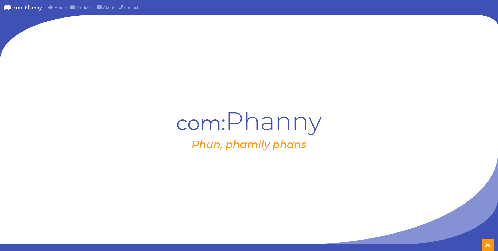

# Comphanny Template `v1.1.0`

View template [here](https://davinaleong.github.io/proj-comphaanyy-template/)!

This is a template of a fake Company I built and designed for a CraftCMS project.

Note that this project doesn't come with a pre-configured _SASS compiler_.
I was lazy to code up a Webpack or Gulp script for it, so I just used a VS Code extension to do the job 😛...

## Tech Stack

- Font Awesome 5
- Bootstrap 4
- SASS

## Screenshots

## How to Use

### As-is

I designed this template to be simple to integrate with CraftCMS (or Laravel).

Necessary files:

- `./fonts/*`
- `./images/*`
- `./styles/styles.css`
- `./vendor/*`

Copy these into the `./public` or `./web` folder of your CraftCMS / Laravel project.

Note: you don't need `bootstrap.css` as it's compiled together in `styles.css`.

### Customise

Building off this template requires:

- Bootstrap 4 installed via `npm`
- SASS
- Your own SASS compiler