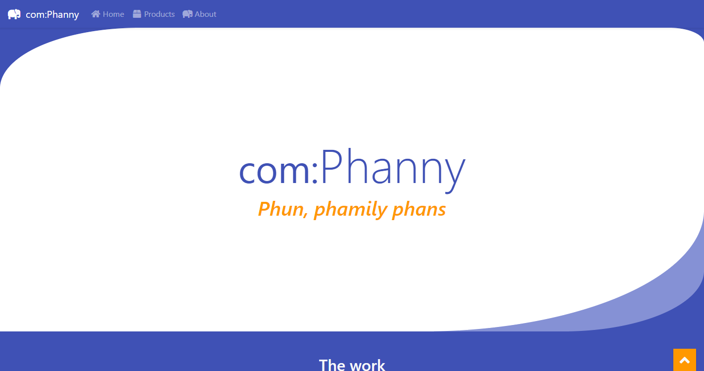

# Comphanny Template `v1.0.0`
View template [here](https://davinaleong.github.io/proj-comphaanyy-template/)!

This is a template of a fake Company I built and designed for a CraftCMS project.

Note that this project doesn't come with a pre-configured SASS compiler. I was lazy to code up a Webpack or Gulp script for it, so I just used a VS Code extension to do the job 😛...

## Tech Stack

- Font Awesome 5
- Bootstrap 4
- SASS

## Screenshots
